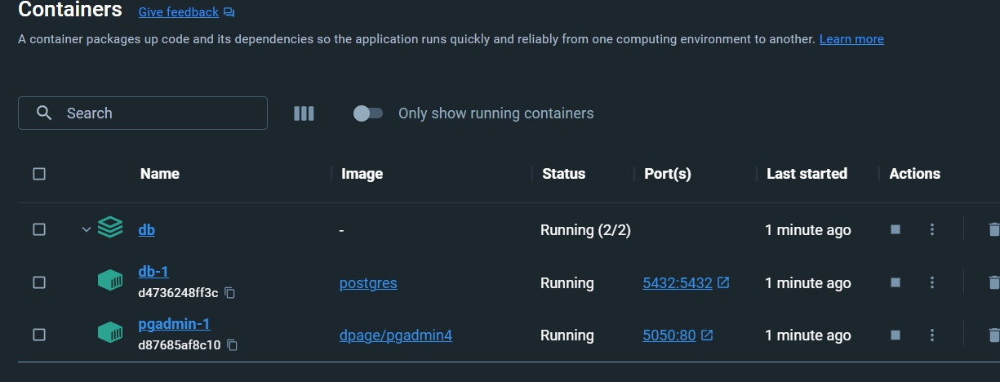
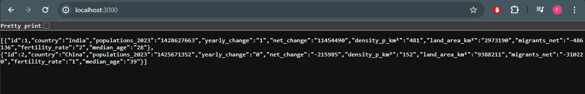

### PostgreSQL Docker Compose
Create the __docker-compose.yml__ file which pulls the _postgres_ image, as well as _pgadmin_, which a graphical tool for managing your PostgreSQL database. 

```yml
version: '3.8'

services:
  db: 
    image: postgres
    environment:
      - POSTGRES_USER=${POSTGRES_USER}
      - POSTGRES_PASSWORD=${POSTGRES_PW}
      - POSTGRES_DB=${POSTGRES_DB}
    ports:
      - "5432:5432"
    volumes:
      - pgdata:/var/lib/postgresql/data
      - ./init.sql:/docker-entrypoint-initdb.d/init.sql

  pgadmin:
    image: dpage/pgadmin4
    environment:
      PGADMIN_DEFAULT_EMAIL: ${PGADMIN_DEFAULT_EMAIL}
      PGADMIN_DEFAULT_PASSWORD: ${PGADMIN_DEFAULT_PASSWORD}
      PGADMIN_CONFIG_SERVER_MODE: 'False'
    volumes:
       - pgadmin:/var/lib/pgadmin
    ports:
      - "5050:80"
    depends_on:
      - db

volumes:
  pgdata:
  pgadmin: 
```
Define an environment file __.env__ for variables in the docker compose which contains the key referred to in file. An example of the file would be like below.
``` 
# Database env
POSTGRES_USER=postgres
POSTGRES_PW=testpw
POSTGRES_DB=testDB

# pgadmin
PGADMIN_DEFAULT_EMAIL=admin4@admin.com
PGADMIN_DEFAULT_PASSWORD=admindb

```
Run the compose file in the directory via ``` docker compose up ```. And the container should be running like below


Then visit the route hosting pgadmin _http://localhost:5050/_. Here you can connect to the postgresl database ruuning in the docker container

### Simple Express Application 
Create an express application and install the two packages [Express](https://expressjs.com/en/starter/installing.html),  [node-postgres](https://node-postgres.com/) and [dot-env](https://www.npmjs.com/package/dotenv) 

Create the __index.js__ file, which would contain the application and the database connnection.

```JS
import express from "express";
import pg from "pg";
import dotenv from "dotenv";

dotenv.config();
const app = express();
const PORT = 3000;
const { Client } = pg;

const client = new Client({
    user: process.env.DB_USER,
    host: process.env.HOSTNAME,
    port: process.env.PORT,
    database:process.env.DB_NAME,
    password: process.env.DB_PASSWORD,
});

await client.connect(); 

export const countrypopulationquery = {
  name: 'fetch-allitem',
  text: 'SELECT * FROM countrypopulation'
}

app.get('/', async(req, res) => {
    try {
        const result = await client.query(countrypopulationquery);
        res.status(200).json(result.rows);
        
    } catch (err) {
        console.error(err);
        await client.query('ROLLBACK');
        res.status(400).json({'message': 'No item found' });
    }finally {
        await client.end()
    }
});


app.listen(PORT, ()=>{
    console.log(`Server Running on Port ${PORT}`)
});

 ```
The final output on request to express application.

