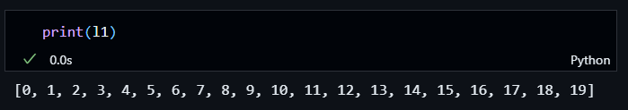
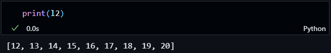
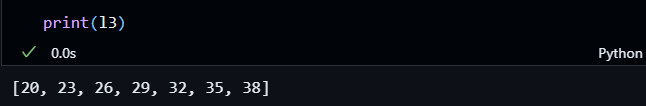
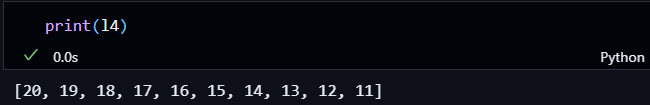
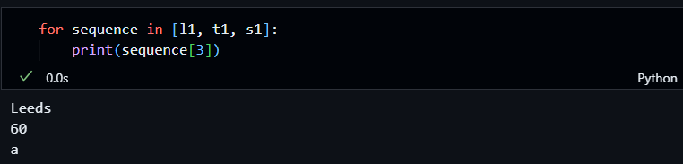
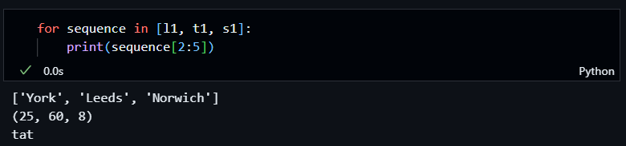
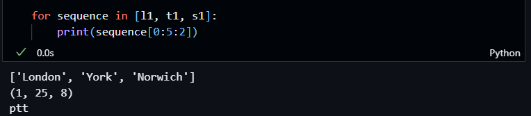
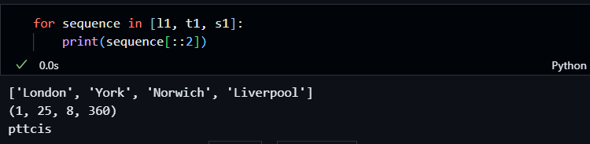
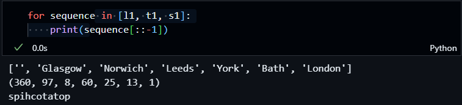

### Using range() 
We can use the range() function to generate an integer sequence. With optional inputs such as: 
- range(__num__), produces an integer sequence from 0 to num-1.
    ```python
    l1 = list(range(20))
    ```
     

- range(__start_num__,__end_num__) produces an integer sequence from start_num to end_num-1.
    ```python
     l2 = list(range(12, 21))
    ```
    

- range(__start_num__,__end_num__,__step__) produces an integer sequence from start_num to end_num-1 with step has the difference between neighboring integer. 
    ```python
     l3 = list(range(20, 40,3))
    ```
    
    
    ```python
     l4 = list(range(20, 10,-1))
    ```
    


### Using Slicing 
Slicing is a technique used to manipulate and access sub-sets of sequences such as list, str and tuple. It uses __[index]__, __[start:end]__, or __[start:end:step]__ syntax on the sequence.

Firstly, let us define some example sequences has the following. 
```python 
    l1 = ['London','Bath', 'York', 'Leeds', 'Norwich', 'Glasgow', 'Liverpool']
    t1 = (1, 13, 25, 60, 8, 97, 360)
    s1 = "potatochips"
```
- example_sequence[__index__] to access the _n-th_ item in the sequence where n = 3.Also example_sequence[0] will return the first item, and example_sequence[-1] will return the last item.
    
   

- example_sequence[__start:end__] to access a consecutive subset of the sequence, up to end-1 items.
    
  
- example_sequence[__start:end:step__] to better control what subset in the sequence we would like returned.
    1. To retrive every second item between the first and the fifth in the sequence. 
        
    
    2. To retrive every second item in the sequence.
        
    
    3. To retrive every item in the sequence starting from the last to the first.
        


