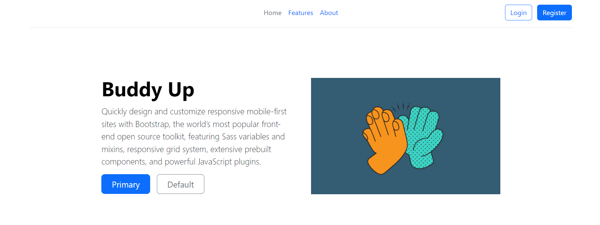

## Buddy App
A Flask application allow uses to create a task and appoint a buddy which reminders are sent to, to remind the task creator.

#### Technology Used 
- Flask
- SQLite
- Docker
- Bootstrap (HTML and CSS)
- Jinja Templating

### Features 
- Create Tasks, set the due dates, as well as a friend or two email.


### To Run 
1. Build the env.dev file with variables like below: 
    ```
    POSTGRES_USER=buddyPostgres
    POSTGRES_PW=buddySecret
    POSTGRES_DB=buddyDB

    FLASK_APP=src/application/__init__.py
    FLASK_RUN_PORT=8080
    FLASK_DEBUG=1
    FLASK_ENV="development"
    SECRET_KEY='9OLWxND4o83j4Kty567luy'
    DATABASE_URL=postgresql://buddyPostgres:buddySecret@db:5432/buddyDB
    SQL_HOST=db
    SQL_PORT=5432
    DATABASE=postgres
    APP_FOLDER=/usr/src/app
    
    
    ```
2. Build and run the docker container 
    ``` 
        docker compose build
        docker compose up
    ```
3. Go to [localhost](http://localhost:8080/). 

#### Image 
 
