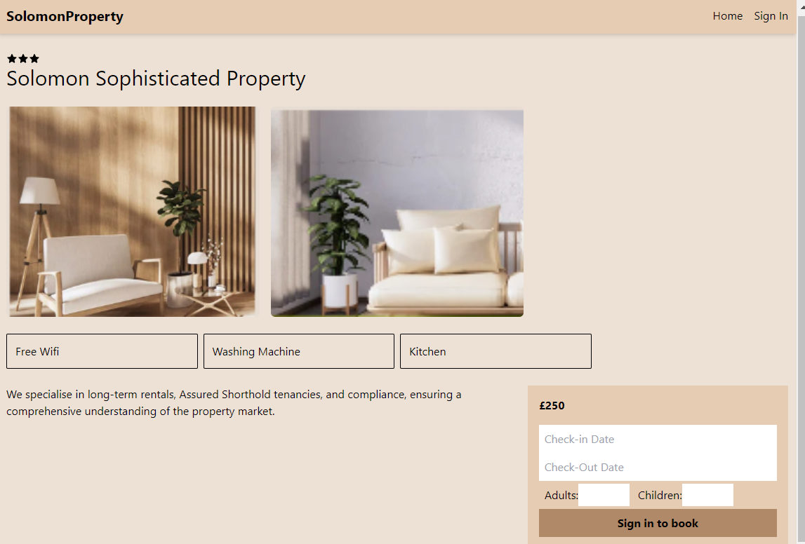

## Residential HomeBooking App

### Objective
An Application that allows residental rental to added and booked.

#### Technology Used 
- Mongodb
- Stripe
- React
- Express

### Features
 - Booking Property and Payment.
 - Users can see their bookings.
 - Admin can add property and edit properties.

[View Here](https://signatureproperty.onrender.com/)

#### Images  
  

